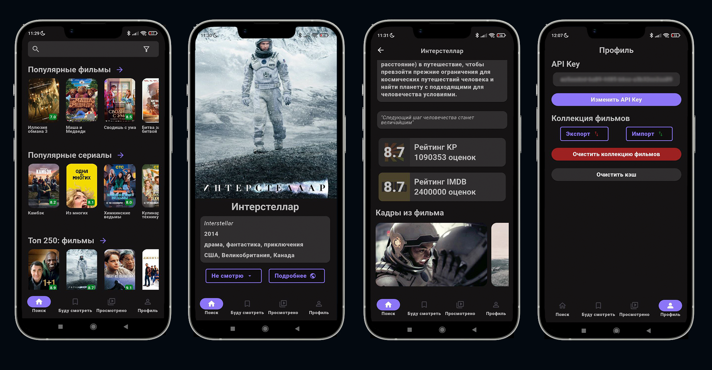

# Movie Search Assistant - v1.0.0

Мобильное приложение для поиска фильмов, управления коллекциями и просмотра подробной информации о фильмах.

## Kinopoisk Api Unofficial
Для доступа к актуальной информации сервиса "Кинопоиск" используется неофициальное API - [Kinopoisk Api Unofficial](https://kinopoiskapiunofficial.tech)

_❗️ВАЖНО: Для использования главных возможностей мобильного приложения необходимо зарегистрироваться на сайте [Kinopoisk Api Unofficial](https://kinopoiskapiunofficial.tech) для получения личного API Key_

_Примечание: Для обычных пользователей лимит запросов в мобильном приложении составляет - 500 запросов_

## Возможности мобильного приложения
_❗️ВАЖНО: Для использования главных возможностей мобильного приложения необходимо подключение к интернету и ввод API Key_

- Поиск фильмов по ключевому слову, фильтрам (страна, год выхода, жанр)
- Просмотр готовых коллекций фильмов (популярные фильмы, сериалы, топ 250)
- Просмотр подробной информации о каждом фильме (описание, рейтинг, кадры из фильма)
- Сохранение фильмов в личные коллекции ("Буду смотреть", "Просмотрено")

_Примечание: Сохранение фильмов осуществляется в локальное хранилище устройства_
- Экспорт/импорт коллекций фильмов в виде файла формата ".json"
- Просмотр коллекций "Буду смотреть" и "Просмотрено" и подробной информации о каждом фильме

_Примечание: Просмотр сохраненных фильмов доступен без интернет-соединения_
- Изменение API Key
- Очистка коллекций фильмов

## Зависимости проекта
Flutter 3.35.4 • channel stable • https://github.com/flutter/flutter.git

Dart 3.9.2

DevTools 2.48.0

